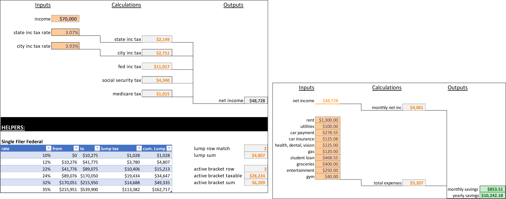
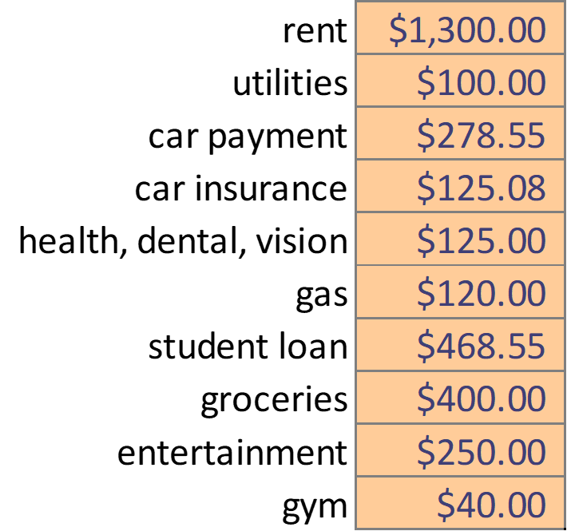
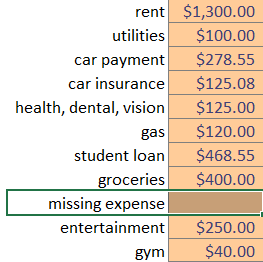

# savings-calculator
A template for roughly estimating take-home savings given an inputted salary, state/local tax rate, and expenses.  Not all expenses included in the calculations, so adjust the template as needed.

## Overview of Tabs

<ul>
  <li>Table of Contents</li>
  <li>net income calculator</li>
  <li>savings calculator</li>
</ul>

## How to Use

<ol>
  <li>
    Navigate to the <em>net income calculator</em> tab and adjust the cells formatted as "input" style.
      
    </img>
  </li>
  <li>
    Navigate to the <em>savings calculator</em> tab and adjust the cells formatted as "input" style.
        
    </img>
  </li>
  <li>
    Add in any missing expenses that apply.  This can be accomplished by inserting a missing expense in the list of expenses, then changing the formula in the <em>total expenses</em> cell to include the addition of this new expense.
      
    </img>
  </li>
</ol>

## Features / Best Practices

<ul>
  <li>
    <b>Appropriate Cell Styling</b>
      
    Cells are styled based on the cell's purpose.  Inputs, calculations, outputs, and linked cells are styles included in this workbook.
  </li>
  <li>
    <b>Named Cells</b>
      
    Cells are named using the keyboard shortcut <em>Shift+F3</em>.  This allows for the use of the cell as if it represents a variable.  The primary benefit of naming a cell is to increase readability in formulas that utilize that cell.
  </li>
  <li>
    <b>Tab Hyperlinks</b>
      
    Hyperlinks are included in the <em>Table of Contents</em> to navigate the workbook.  Additionally, there is a hyperlink in each tab for navigating back to the <em>Table of Contents</em>.
  </li>
</ul>

