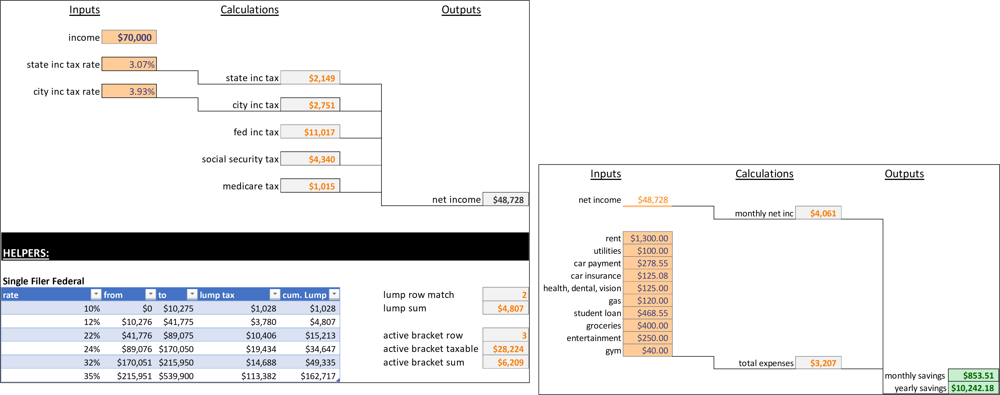

# savings-calculator
A template for determining a rough estimation of savings given an inputted salary.  Not all expenses included in the calculations, so adjust the template as needed. 

## Overview of Tabs

<em>Table of Contents</em>
