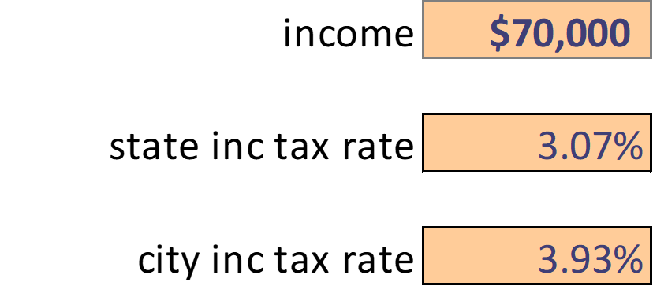

# savings-calculator
A template for determining a rough estimation of savings given an inputted salary.  Not all expenses included in the calculations, so adjust the template as needed. 

## Overview of Tabs

<ul>
  <li>Table of Contents</li>
  <li>net income calculator</li>
  <li>savings calculator</li>
</ul>

## How to Use

<ol>
  <li>
    Navigate to the <em>net income calculator</em> tab and adjust the cells formatted as "input" style.
    </img>
  </li>
  <li>
    Navigate to the <em>savings calculator</em> tab and adjust the cells formatted as "input" style.
    </img>
  </li>
  <li>
    Add in any missing expenses that apply.  This can be accomplished by inserting a missing expense in the list of expenses, then changing the formula in the <em>total expenses</em> cell to include the addition of this new expense.
    </img>
  </li>
</ol>

